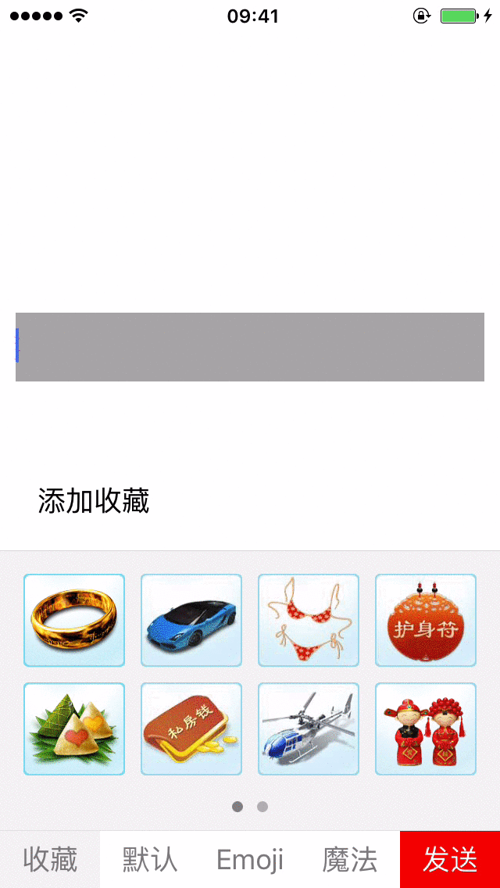
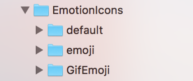
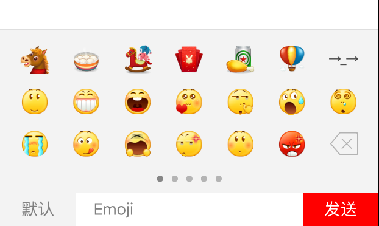

# EmotionKeyboard
==============

之前项目中的表情键盘,现在和大家分享一下吧,写的不好,不喜勿喷!<br/>

已经实现动态添加图片到收藏,长按删除收藏图片


## 效果图

<br/>

直接把文件中的EmotionKeyboard文件添加到项目中即可,本项目依赖 [MJExtension](https://github.com/CoderMJLee/MJExtension),需要注意的是项目资源文件直接 Create folder reference 形式引入.
<br/><br/>

## 使用方法
### 提供4种创建方法
```
    EmotionKeyboard *emotionKeyBoard = [[EmotionKeyboard alloc]initWithFrame:CGRectMake(0, ScreenH - 235, ScreenW, 235)];
    
    EmotionKeyboard *emotionKeyBoard = [[EmotionKeyboard alloc]init];
    
    EmotionKeyboard *emotionKeyBoard = [[EmotionKeyboard alloc]initWithDefault];
    
    EmotionKeyboard *emotionKeyBoard = [EmotionKeyboard sharedEmotionKeyboardView];
```
<li>initWithFrame: 可自己指定键盘大小 已经做适配 默认为有四个选项 
<li>init: 默认Frame为 CGRectMake(0, ScreenH - 216, ScreenW, 216) 默认为有四个选项 
<li>sharedEmotionKeyboardView:单利模式 默认Frame为 CGRectMake(0, ScreenH - 216, ScreenW, 216) 默认为有四个选项

<li>initWithDefault: 默认Frame为 CGRectMake(0, ScreenH - 216, ScreenW, 216) 只有默认的小表情 <br/>
<br/>


默认创建大小自己可修改

### 接口
本项目是代理对外传值,只需成为代理 主要代理方法如下

```
/**
 *  获取图片对应文字
 *  @param text 文字
 */
- (void)emoticonInputDidTapText:(NSString *)text;

/**
 *  获取图片表情对应的url
 *  @param url 图片路径
 */
- (void)emoticonImageDidTapUrl:(NSString *)url;

/**
 *  删除表情按键点击
 */
 
- (void)emoticonInputDidTapBackspace;
/**
 *  发送表情按钮点击
 */
- (void)emoticonInputDidTapSend;


```

### 扩展接口
扩展接口都放到EmotionTool 文件中
<li>添加图片到收藏

```
/**
 *  添加图片到收藏
 *  @param url 图片url
 */
+ (void)addCollectImage:(NSString *)url;

//使用
 [EmotionTool addCollectImage:url];

```

如果需要替换默认表情,请替换资源文件. 并按照对应要去修改资源目录下info.plist文件 <br/>
默认素材来自于新浪微博

### 具体使用方法 --参考demo

```
    UITextField *text = [[UITextField alloc]initWithFrame:CGRectMake(10, 200, 300, 44)];
    text.backgroundColor = [UIColor lightGrayColor];

//    EmotionKeyboard *emotionKeyBoard = [[EmotionKeyboard alloc]initWithFrame:CGRectMake(0, ScreenH - 235, ScreenW, 235)];
    
//    EmotionKeyboard *emotionKeyBoard = [[EmotionKeyboard alloc]init];
    
//    EmotionKeyboard *emotionKeyBoard = [[EmotionKeyboard alloc]initWithDefault];
    
    EmotionKeyboard *emotionKeyBoard = [EmotionKeyboard sharedEmotionKeyboardView];
    emotionKeyBoard.delegate = self;
    text.inputView = emotionKeyBoard;
    _textFild = text;

// FaceBoardDelegateMethods

/**
 *  删除表情按钮点击
 */
- (void)emoticonInputDidTapBackspace
{
    NSString* inputString;
    inputString =  _textFild.text;
    NSString* string = nil;
    NSInteger stringLength = inputString.length;
    
    if (stringLength > 0) {
        if (stringLength == 1 || stringLength == 2) {//只有1个或2个字符时
            if ([inputString isEmoji]) {//emoji
                string = @"";
            }else {//普通字符
                string = [inputString substringToIndex:stringLength - 1];
            }
        }else if ([@"]" isEqualToString:[inputString substringFromIndex:stringLength - 1]]) {//默认表情
            
            if ([inputString rangeOfString:@"["].location == NSNotFound) {
                string = [inputString substringToIndex:stringLength - 1];
            }else {
                string = [inputString substringToIndex:[inputString rangeOfString:@"["options:NSBackwardsSearch].location];
            }
        }else if ([[inputString substringFromIndex:stringLength - 1] isEmoji] || [[inputString substringFromIndex:stringLength - 2] isEmoji]) {//末尾是emoji
            
            if ([[inputString substringFromIndex:stringLength - 2] isEmoji]) {
                string = [inputString substringToIndex:stringLength - 2];
            }else if ([[inputString substringFromIndex:stringLength - 1] isEmoji]) {
                string = [inputString substringToIndex:stringLength - 1];
            }
        }else {//是普通文字
            string = [inputString substringToIndex:stringLength - 1];
        }
    }
    [_textFild setText:string];
    
}

/**
 *  发送表情按钮点击
 */
- (void)emoticonInputDidTapSend
{
    NSLog(@"发送");
//    [self sendComment];
}

/**
 *  获取表情对应字符
 *
 *  @param text 表情对应字符串
 */
- (void)emoticonInputDidTapText:(NSString*)text
{
    [_textFild insertText:text];
}
/**
 *  获取图片表情对应的url
 *
 *  @param url 
 */
- (void)emoticonImageDidTapUrl:(NSString *)url{
    NSLog(@"%@",url);
}


```

有问题欢迎联系我!


